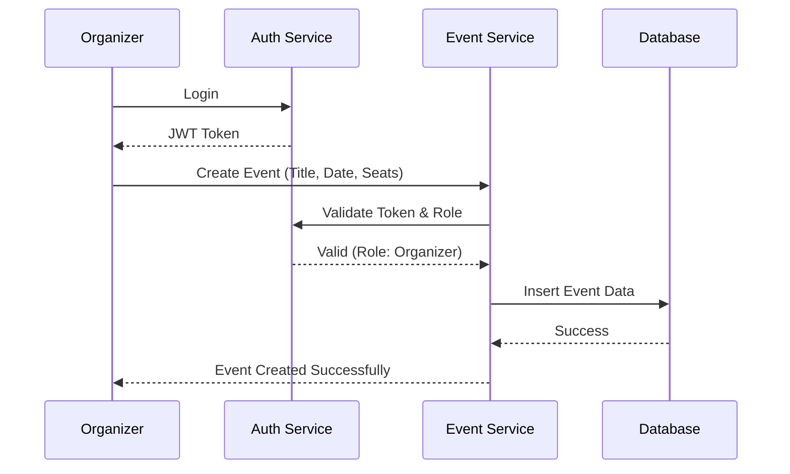
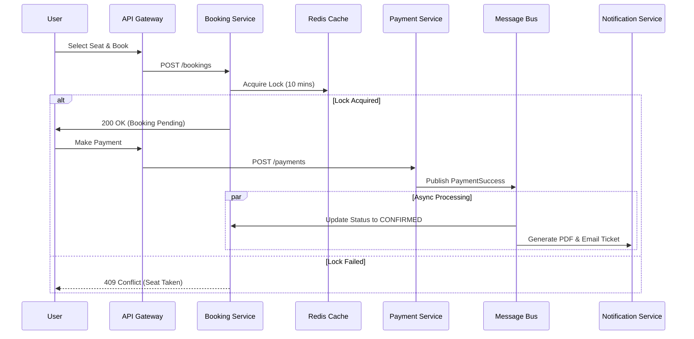

# Distributed Event Ticketing System - Final Project Report

**Author:** [Your Name]  
**Date:** December 18, 2025  
**Course:** Distributed Systems Engineering

---

## 1. Executive Summary

The **Distributed Event Ticketing System** is a scalable, microservices-based platform designed to handle high-concurrency event booking scenarios. It addresses common challenges in ticketing systems such as race conditions (double booking), system overload during peak traffic, and data consistency across distributed services.

The system allows **Organizers** to create and manage events, **Users** to browse and book tickets with real-time seat availability, and **Admins** to oversee the platform. It leverages an Event-Driven Architecture (EDA) using RabbitMQ to ensure decoupling and reliability between services like Booking, Payment, and Notification.

---

## 2. Problem Statement

Traditional monolithic ticketing systems often struggle with:
*   **Scalability:** Inability to handle sudden spikes in traffic (e.g., when tickets for a popular concert go on sale).
*   **Concurrency:** "Double booking" issues where two users purchase the same seat simultaneously.
*   **Reliability:** If one part of the system fails (e.g., email notifications), the entire checkout process might fail.
*   **Maintenance:** Tightly coupled codebases make it difficult to update specific features without risking system-wide regression.

---

## 3. Proposed Solution

This project implements a **Microservices Architecture** to solve these problems:
*   **Scalability:** Each service (Auth, Event, Booking, Payment) can be scaled independently based on load.
*   **Concurrency Control:** Redis distributed locks and optimistic locking in PostgreSQL prevent double bookings.
*   **Resilience:** Asynchronous messaging via RabbitMQ ensures that payments and notifications are processed reliably, even if a service is temporarily down.
*   **Security:** An Nginx API Gateway acts as a single entry point, handling CORS, rate limiting, and routing, while hiding internal service topology.

---

## 4. User Roles and Conceptual Model

The system is designed around three primary user roles, each with distinct workflows and permissions.

### 4.1. User Roles

1.  **Administrator (Admin)**
    *   **Responsibility:** System oversight and security.
    *   **Capabilities:**
        *   View system-wide analytics (total users, active events, revenue).
        *   Approve or reject Organizer applications (KYC verification).
        *   Manage user accounts and permissions.
        *   Access audit logs for security monitoring.

2.  **Event Organizer**
    *   **Responsibility:** Content creation and sales management.
    *   **Capabilities:**
        *   Register and submit verification documents for Admin approval.
        *   Create, update, and delete events.
        *   Define ticket classes (Normal, VIP, VVIP) and pricing.
        *   View real-time sales dashboards and revenue reports.

3.  **Customer (User)**
    *   **Responsibility:** End-user consumption.
    *   **Capabilities:**
        *   Browse and search for events.
        *   View real-time seat availability.
        *   Book tickets (with a temporary seat lock).
        *   Make secure payments.
        *   Receive PDF tickets via email.
        *   View booking history.

### 4.2. Conceptual Workflow

The following diagrams illustrate the high-level flow of operations for the key roles.

#### 4.2.1. Organizer Workflow: Event Creation



#### 4.2.2. User Workflow: Booking & Payment

This is the most critical flow in the system, handling high concurrency.



---

## 5. System Architecture

The system is composed of five core microservices, an API Gateway, and shared infrastructure components.

### 5.1. High-Level Architecture Diagram

```mermaid
graph TD
    %% Client Layer
    Client[Client (Next.js Frontend)]
    
    %% API Gateway
    Gateway[Nginx API Gateway (Port 8080)]
    
    %% Service Layer
    subgraph "Backend Microservices (Internal Network)"
        Auth[Auth Service]
        Event[Event Service]
        Booking[Booking Service]
        Payment[Payment Service]
        Notif[Notification Service]
    end
    
    %% Data Layer
    subgraph "Data & Messaging"
        Postgres[(PostgreSQL)]
        Redis[(Redis Cache)]
        RabbitMQ{RabbitMQ Bus}
    end

    %% Connections
    Client -->|HTTP/REST| Gateway
    
    Gateway -->|/api/auth| Auth
    Gateway -->|/api/events| Event
    Gateway -->|/api/bookings| Booking
    Gateway -->|/api/payments| Payment
    Gateway -->|/api/notifications| Notif

    %% Service-to-Data
    Auth --> Postgres
    Event --> Postgres
    Event --> Redis
    Booking --> Postgres
    Booking --> Redis
    Payment --> Postgres
    Notif --> Postgres

    %% Async Communication
    Booking -->|Publish: BookingCreated| RabbitMQ
    Payment -->|Consume: BookingCreated| RabbitMQ
    Payment -->|Publish: PaymentSuccess| RabbitMQ
    Notif -->|Consume: PaymentSuccess| RabbitMQ
    Event -->|Consume: SeatUpdates| RabbitMQ
```

---

## 6. Detailed Microservices Breakdown

Each microservice is a self-contained unit with its own database schema (logical separation), responsibilities, and API endpoints.

### 6.1. API Gateway (Nginx)
*   **Technology:** Nginx (Alpine Linux)
*   **Port:** 8080
*   **Responsibilities:**
    *   **Reverse Proxy:** Routes requests from `localhost:8080/api/{service}` to the appropriate internal container (e.g., `auth-service:3001`).
    *   **Security:** Hides the internal network topology from the client.
    *   **CORS:** Centralized Cross-Origin Resource Sharing configuration to allow requests from the frontend (`localhost:3000`).
    *   **Load Balancing:** Capable of distributing traffic if multiple instances of a service are deployed.

### 6.2. Auth Service
*   **Technology:** Go (Gin Framework)
*   **Port:** 3001 (Internal)
*   **Database:** `auth_db` (Users, Roles, Refresh Tokens)
*   **Key Responsibilities:**
    *   User Registration and Login.
    *   JWT Token Management (Access Token: 15 min, Refresh Token: 7 days).
    *   **Middleware:** Provides an internal endpoint for other services to validate tokens.
    *   **Organizer Approval:** Handles the workflow for users applying to become organizers.
*   **Key Endpoints:**
    *   `POST /register`: Create new account.
    *   `POST /login`: Authenticate and receive JWT.
    *   `POST /admin/approve`: Admin approves an organizer.

### 6.3. Event Service
*   **Technology:** Go (Gin Framework)
*   **Port:** 3003 (Internal)
*   **Database:** `event_db` (Events, Categories, Venues)
*   **Caching:** Redis (Event details, Seat availability)
*   **Key Responsibilities:**
    *   Event CRUD operations.
    *   Managing seat inventory (Normal, VIP, VVIP).
    *   Serving event data to the frontend with high performance via Redis caching.
*   **Key Endpoints:**
    *   `GET /events`: List all events.
    *   `POST /events`: Create a new event (Organizer only).
    *   `GET /events/:id`: Get detailed event info.

### 6.4. Booking Service
*   **Technology:** Go (Gin Framework)
*   **Port:** 3002 (Internal)
*   **Database:** `booking_db` (Bookings, Tickets)
*   **Key Responsibilities:**
    *   **Concurrency Control:** Implements the "Seat Locking" mechanism using Redis.
    *   **Order Management:** Creates booking records in `PENDING` state.
    *   **Saga Orchestration:** Initiates the distributed transaction for ticket purchase.
*   **Key Endpoints:**
    *   `POST /bookings`: Attempt to reserve a seat.
    *   `GET /bookings/user`: Get booking history for the logged-in user.

### 6.5. Payment Service
*   **Technology:** Go (Gin Framework)
*   **Port:** 3004 (Internal)
*   **Database:** `payment_db` (Transactions, Payment Methods)
*   **Key Responsibilities:**
    *   Processing payments (simulated integration).
    *   Idempotency: Ensures the same payment isn't processed twice.
    *   Event Publishing: Emits `PaymentSuccess` or `PaymentFailed` events to RabbitMQ.
*   **Key Endpoints:**
    *   `POST /payments/initialize`: Start payment process.
    *   `POST /payments/webhook`: Callback for payment providers.

### 6.6. Notification Service
*   **Technology:** Go (Gin Framework)
*   **Port:** 3005 (Internal)
*   **Database:** `notification_db` (Email Logs, Templates)
*   **Key Responsibilities:**
    *   Listening to RabbitMQ for `PaymentSuccess` events.
    *   Generating PDF tickets using a template engine.
    *   Sending emails via SMTP (e.g., Gmail, SendGrid).
*   **Key Endpoints:**
    *   `GET /notifications/tickets/:id/download`: Download ticket PDF.

---

## 7. Key Features & Implementation Details

### 7.1. Concurrency Handling (The "Double Booking" Problem)
To ensure two users cannot book the same seat:
1.  **Redis Mutex:** When a user selects a seat, a temporary key (`lock:seat:{event_id}:{seat_no}`) is created in Redis with a TTL (Time-To-Live) of 10 minutes.
2.  **Atomic Check-and-Set:** The lock acquisition is atomic. If User A gets the lock, User B's request fails immediately with a "Seat Unavailable" message.
3.  **Database Constraint:** A unique constraint on `(event_id, seat_number)` in PostgreSQL serves as a final fail-safe.

### 7.2. Event-Driven Architecture (EDA)
The system uses **RabbitMQ** to decouple services. This ensures that:
*   **Performance:** The user gets a fast response after payment, while email generation happens in the background.
*   **Reliability:** If the Notification Service is down, messages queue up in RabbitMQ and are processed when the service comes back online (Message Durability).

### 7.3. Security Implementation
*   **JWT Authentication:** Stateless authentication allows services to scale without sharing session state.
*   **Password Hashing:** Bcrypt is used for secure password storage.
*   **Network Isolation:** Backend services run on an internal Docker network (`event-network`) and are not exposed to the public internet; only Nginx is accessible.
*   **Input Validation:** All incoming requests are validated using Go structs and binding tags to prevent injection attacks.

---

## 8. Technology Stack

| Component | Technology | Justification |
| :--- | :--- | :--- |
| **Frontend** | Next.js 16 (React) + Tailwind css 4| Server-side rendering for SEO, modern UI components (Shadcn/UI). |
| **Backend** | Go (Golang) + Gin | High performance, strong concurrency support, low memory footprint. |
| **Database** | PostgreSQL | ACID compliance for critical transactional data (bookings, payments). |
| **Cache** | Redis | Fast in-memory access for seat locking and session management. |
| **Message Broker** | RabbitMQ | Reliable message queuing for decoupling microservices. |
| **Containerization** | Docker & Docker Compose | Consistent development and deployment environments. |
| **Gateway** | Nginx | Efficient load balancing and reverse proxying. |

---

## 9. Conclusion and Future Work

The Distributed Event Ticketing System successfully demonstrates how modern cloud-native patterns can solve complex concurrency and scalability challenges. By decomposing the application into microservices, we achieved better fault isolation and independent scaling.

**Future Improvements:**
*   **Kubernetes Deployment:** Migrate from Docker Compose to K8s for auto-scaling and self-healing.
*   **Monitoring:** Integrate Prometheus and Grafana for real-time metrics.
*   **Payment Gateway:** Integrate a real provider like Stripe or PayPal.
*   **WebSocket:** Implement real-time seat map updates for users viewing the same event.

---
