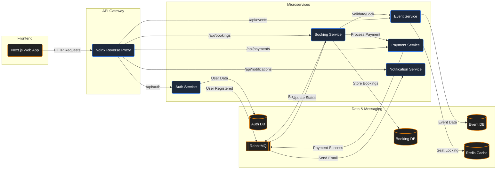

# Distributed Event Ticketing System

A robust, microservices-based event ticketing platform designed to handle high-concurrency ticket bookings. This project demonstrates a modern distributed architecture using Go for backend services and Next.js for a responsive frontend interface.

## 🚀 Project Overview

The Distributed Event Ticketing System allows users to browse events, select specific seats (including VIP/VVIP classes), and book tickets in real-time. It features a secure authentication system, an admin dashboard for event management, and a resilient booking flow that handles concurrency using locking mechanisms.

### Key Features
- **Microservices Architecture**: Decoupled services for scalability and maintainability.
- **Real-time Seat Booking**: Interactive seat selection with concurrency handling.
- **User & Admin Roles**: distinct dashboards and capabilities for admins and regular users.
- **Secure Authentication**: JWT-based auth with auto-logout and state persistence.
- **Resilient State Management**: Persists booking flows across page refreshes.
- **Automated Notifications**: Email notifications for booking confirmations (simulated).

## 🏗️ System Architecture



## 🛠️ Tech Stack

### Backend
- **Language**: Go (Golang)
- **Framework**: Gin Web Framework
- **Gateway**: Nginx (Reverse Proxy)
- **Databases**: PostgreSQL (Primary), Redis (Caching & Locking)
- **Message Broker**: RabbitMQ (Async communication)
- **Containerization**: Docker & Docker Compose

### Frontend
- **Framework**: Next.js 16 (App Router)
- **Library**: React 19
- **Styling**: Tailwind CSS 4
- **UI Components**: Radix UI / Shadcn
- **State Management**: React Context API + LocalStorage

## 📂 Project Structure

```
event_ticketing/
├── backend/                # Go microservices and Docker config
│   ├── auth-service/       # User authentication & authorization
│   ├── booking-service/    # Ticket booking logic
│   ├── event-service/      # Event & seat management
│   ├── notification-service/ # Email/SMS notifications
│   ├── payment-service/    # Payment processing simulation
│   └── docker-compose.yml  # Orchestration for all services
│
├── frontend/               # Next.js client application
│   ├── src/app/            # App router pages & layouts
│   ├── src/components/     # Reusable UI components
│   └── src/context/        # Global state management
│
└── README.md               # This file
```

## 🏁 Getting Started

### Prerequisites
- **Docker Desktop** (for running backend services and databases)
- **Node.js** (v18+ recommended)
- **Go** (v1.24+ if running services locally without Docker)

### 1. Start the Backend
The backend relies on several infrastructure components (Postgres, Redis, RabbitMQ). The easiest way to run it is via Docker Compose.

```bash
cd backend
# Create a .env file if not present (see backend/README.md)
docker-compose up --build
# To run and start all the services in the background
docker compose up -d
```

### 2. Start the Frontend
Once the backend services are running:

```bash
cd frontend
# Install dependencies
npm install
# Run the development server
npm run dev
```

Open [http://localhost:3000](http://localhost:3000) in your browser.

## 📚 Documentation

- **Backend Details**: See [backend/README.md](./backend/README.md) for API endpoints, service details, and environment configuration.
- **Frontend Details**: See [frontend/README.md](./frontend/README.md) for component structure, routing, and UI customization.

## 🤝 Contributing

1. Fork the repository
2. Create your feature branch (`git checkout -b feature/amazing-feature`)
3. Commit your changes (`git commit -m 'Add some amazing feature'`)
4. Push to the branch (`git push origin feature/amazing-feature`)
5. Open a Pull Request

## 📄 License

This project is licensed under the MIT License.
